# Nixie clock

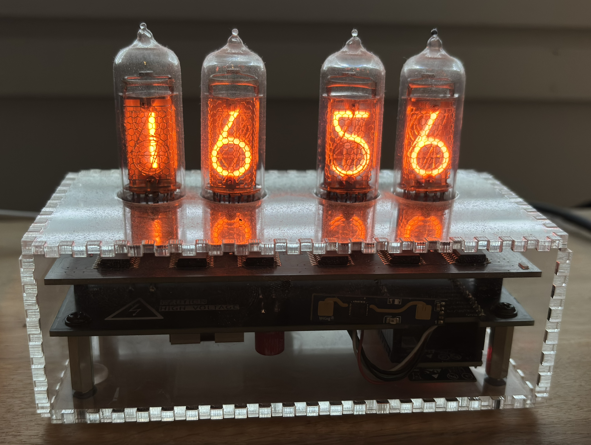

ESP-IDF firmware for a four-tube HH:MM nixie clock on an ESP32-C6. The clock gets the time from SNTP over Wi-Fi, drives the tubes through shift registers, and serves a web page for setup and settings.

## Contents

- [What it does](#what-it-does)
- [How to use it](#how-to-use-it)
  - [First start](#first-start)
  - [Configuration](#configuration)
- [Functionality](#functionality)
  - [Display](#display)
    - [Clock](#clock)
    - [Cathode poisoning prevention routine](#cathode-poisoning-prevention-routine)
    - [Random digits](#random-digits)
  - [Brightness](#brightness)
  - [Presence](#presence)
  - [Time](#time)
  - [Network](#network)
- [How the hardware works](#how-the-hardware-works)
  - [Tubes](#tubes)
  - [Shift registers](#shift-registers)
  - [High-voltage supply](#high-voltage-supply)
  - [Presence sensor](#presence-sensor)
- [Build and flash](#build-and-flash)
- [Supported hardware](#supported-hardware)

## What it does

- Shows hours and minutes on four nixie tubes.
- Joins your saved Wi-Fi network and sets the clock from SNTP.
- Opens a setup network when it has no saved network, or when it cannot join.
- Can dim the tubes during night hours, and can turn the high-voltage supply off when nobody is nearby.
- Rolls the digits on a timer to reduce cathode poisoning.
- Crossfades digit changes when that effect is enabled.

Wi-Fi credentials are entered in the browser and stored on the clock.

## How to use it

### First start

1. Power the board from a 5 V supply that can provide 2 A, for example a USB phone charger. A 1 A supply may be insufficient. It opens a setup network named `NixieClock-XXXX`.
2. Join that network and open `http://nixie.local/`. If the name does not resolve, open `http://192.168.4.1/`.
3. Enter your SSID and password, then press **Join**. Tick **Hidden network** if the network is not advertised.
4. To access the configuration page, disconnect from the `NixieClock-XXXX` network, reconnect to your network, and open `http://nixie.local/` again.

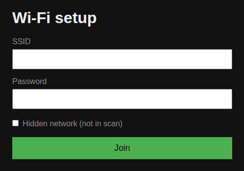

### Configuration

On your network, `http://nixie.local/` opens five menus. Each **Save settings** button stores that menu on the clock, and the values stay after a reboot.

| Menu | What you can change |
|---|---|
| Display | Fade, cathode-poisoning routine, and random digits |
| Brightness | Day and night levels, night hours, and the transition between them |
| Presence | Idle timeout that turns the tubes off |
| Time | Timezone and daylight saving |
| Network | Connection details, and forgetting the saved network |

**Forget current network** on the Network page clears the saved credentials and returns the clock to the setup network.

## Functionality

The pictures are the pages from a configured clock. The values in them are that clock's saved settings, not the defaults described here.

### Display

#### Clock

The clock normally shows the current time. When fade is enabled, a digit change crossfades from the old digits to the new ones. Fade duration is how long that crossfade takes. The default is 500 ms, and it can be set from 1 ms to 5000 ms. **Test fade** fades every digit back and forth using the fade duration that is currently set. **Show clock** returns to the time.

<figure class="clip">
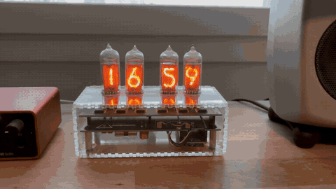
<figcaption><strong>All digits fading.</strong> Each tube crossfades to another digit and back, using the current fade duration.</figcaption>
</figure>

#### Cathode poisoning prevention routine

A nixie tube lights one cathode, the shaped digit, inside a gas-filled envelope. Metal slowly leaves the lit cathode and can settle on cathodes that stay dark. A clock repeats the same digits for long stretches, so unused digits grow dim, patchy, or fail to light. The routine walks every symbol on each tube so every cathode is lit regularly and that deposit does not build up.

You set the hold time for each digit, the starting offset, the run length, and whether it counts down. **Repeat every** is how many minutes pass between automatic runs. The default is 5 minutes. **Run cathode poisoning prevention routine** starts one run immediately.

<figure class="clip">
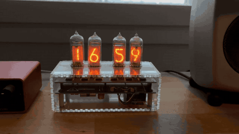
<figcaption><strong>Cathode poisoning prevention.</strong> The tubes walk through every symbol so each cathode is lit.</figcaption>
</figure>

#### Random digits

Random digits shows a changing pattern instead of the time. You set the hold time and how long the pattern runs. **Run random** starts it.

<figure class="clip">
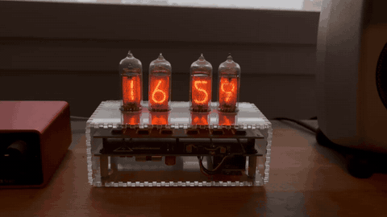
<figcaption><strong>Random digits.</strong> The tubes show a changing pattern instead of the time.</figcaption>
</figure>

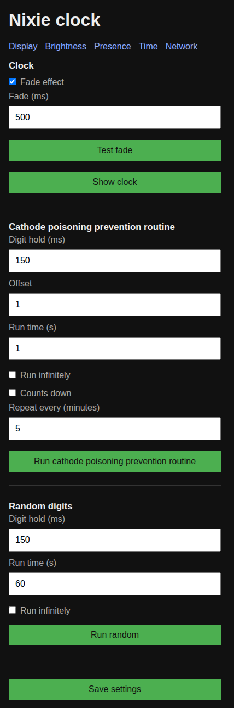

### Brightness

Tube brightness is controlled with PWM. The brightness number is the PWM duty-cycle, from 0 to 100. The defaults are 80 during the day and 60 at night. Night mode is off by default. When it is on, it runs from a start hour until an end hour and may cross midnight. The default night hours are 23:00 to 07:00. **Transition** is how many seconds the brightness takes to move between those levels, from 1 to 60. The default is 10 seconds. **Test transition** runs one change between the day and night levels.

A brightness of 0 turns the high-voltage supply off.

<figure class="clip">
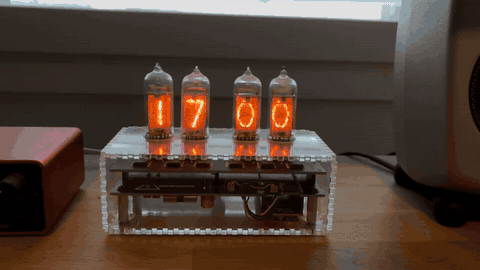
<figcaption><strong>Brightness from full to off.</strong> The tubes dim from duty-cycle 100 to 0, then return to 100.</figcaption>
</figure>

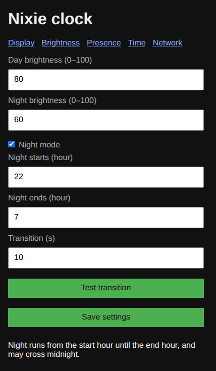

### Presence

With the presence sensor enabled, the tubes turn off after the set number of minutes with nobody nearby. The default is 10 minutes. The allowed range is 1 to 240 minutes. Turning the sensor off leaves the tubes on, aside from a zero brightness setting.

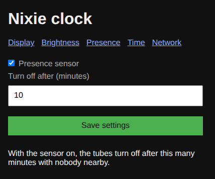

### Time

Choose a timezone from the built-in list. Zones that observe daylight saving have a **Daylight saving** checkbox. The page shows the current clock time and the two SNTP servers compiled into the firmware. The defaults are `pool.ntp.org` and `time.google.com`.

The list covers UTC, the United Kingdom, Central and Eastern Europe, Finland, Moscow, India, China, Japan, Australia Eastern, and the four continental US zones.

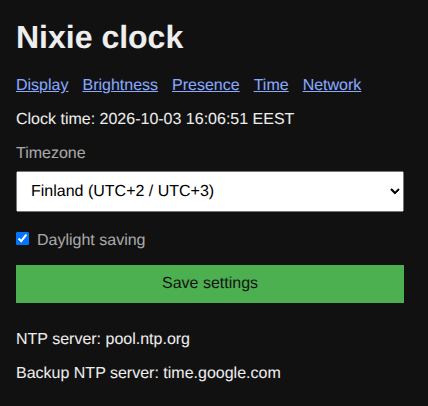

### Network

The Network page shows the connected network, assigned IP address, firmware version, MAC address, and uptime. **Forget current network** erases the saved Wi-Fi credentials and starts the setup network again.

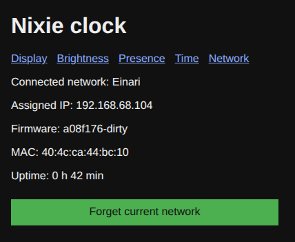

## How the hardware works

The clock is two boards. The lower board makes 170 V from the 5 V input and carries the presence sensor. The upper board holds four IN-14 nixie tubes and the shift registers that select their digits. An ESP32-C6 development kit is the controller. It gets the time over Wi-Fi and drives the shift registers, the tube brightness, and the high-voltage enable pin.

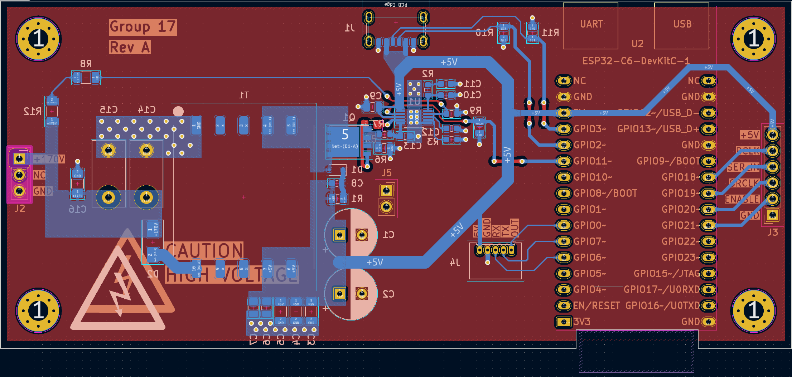

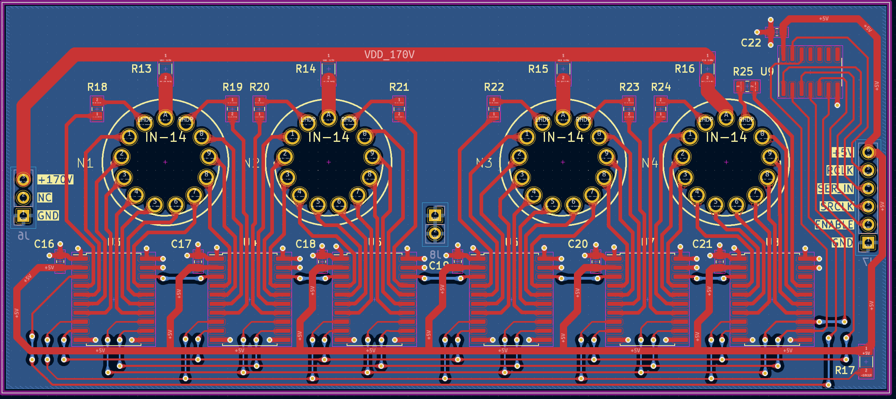

The high-voltage wiring can sit at 170 V while the clock is on. Do not touch that circuitry while it is powered.

### Tubes

Each IN-14 is a gas-filled tube with one common anode and a separate cathode for every symbol. About 170 V between the anode and a cathode ionizes the gas, and the glow takes the shape of that cathode. After the tube has struck, it keeps glowing at a lower voltage, about 145 V. The tube then looks like a short circuit, so each anode has a 13 kΩ resistor that holds the digit current to a few milliamps.

Each tube has cathodes for digits 0–9 and for a left and a right decimal point.

### Shift registers

Six TPIC6B595 shift registers are chained together. Each one has eight open-drain outputs that can pull a cathode to ground. An output that is on lights that cathode. An output that is off leaves it dark. The chain is 48 bits, sent least significant bit first:

| Bits | Tube |
|---|---|
| 47–36 | Hour tens |
| 35–24 | Hour ones |
| 23–12 | Minute tens |
| 11–0 | Minute ones |

Each group of 12 bits is one tube, in this order: left dot, digits 1 through 9, digit 0, right dot.

The controller sends serial data and a clock, then pulses the latch so all six registers update together. Output enable is a PWM signal. Its duty-cycle is the brightness number on the configuration page. The shift registers run from 5 V. Their outputs are clamped so they can sit at the tube voltage when a cathode is off.

### High-voltage supply

A flyback converter raises 5 V to 170 V for the tube anodes. An LT3757 controls the switch. The transformer is a Würth 750032051, with a 1:10 turns ratio so the switch duty-cycle stays in a practical range at 200 kHz. A BSC059N04LS6 MOSFET switches the primary. A VS-3EMH06 diode rectifies the secondary. An RCD snubber clamps the voltage spike on the MOSFET when it turns off. The converter is designed for about 20 mA at 170 V, which is enough for the four tubes. One GPIO enables the converter. Turning that pin off removes the anode voltage and the tubes go dark.

### Presence sensor

An HLK-LD2420 24 GHz radar module watches for a person nearby. It was chosen instead of a passive infrared sensor because it still sees someone who is sitting still. The clock only uses the module's presence output. A high level means someone is nearby, and a low level means the area is empty. When that output stays empty for the configured number of minutes, the firmware turns the high-voltage supply off.

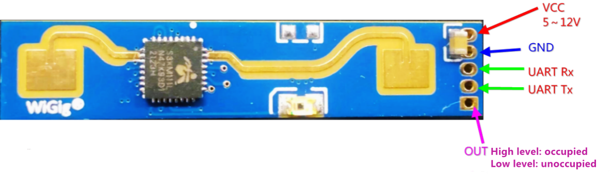

## Build and flash

You need ESP-IDF 6.x. The target is `esp32c6`.

```bash
idf.py set-target esp32c6
idf.py menuconfig   # User Configuration: board and SNTP servers
idf.py build
idf.py -p /dev/ttyUSB0 flash monitor
```

In **User Configuration**:

- **Board** selects the DevKit pin map. The default is `ESP32_C6_WROOM_1`.
- **SNTP server** and **Backup SNTP server** are the only time servers the clock uses.
- **Initial connection retry count** is how many station disconnects to tolerate before giving up on credentials that have not yet received an IP, and before bringing the setup network back after a later disconnect. The default is 5.

Flash through the USB-UART bridge. The commands above use `/dev/ttyUSB0`.

## Supported hardware

| Board | Module | menuconfig |
|---|---|---|
| ESP32-C6-DevKitC-1 | ESP32-C6-WROOM-1 | `ESP32_C6_WROOM_1` (default) |
| ESP32-C6-DevKitM-1 | ESP32-C6-MINI-1 | `ESP32_C6_MINI_1` |

The firmware also expects:

- Four nixie tubes driven by shift registers (latch, data, and clock).
- A high-voltage supply with an enable pin.
- A PWM output-enable line for tube brightness.
- A presence sensor input.

Choosing the wrong board in menuconfig drives the high-voltage enable and the shift-register pins on the wrong GPIOs. The pin map for both kits is in [docs/esp32-c6-devkits.md](docs/esp32-c6-devkits.md).
